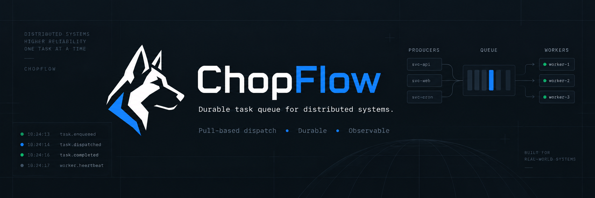
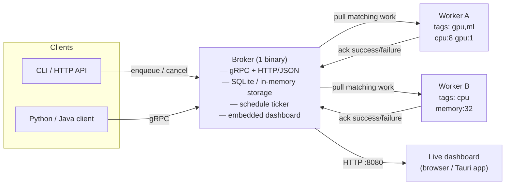
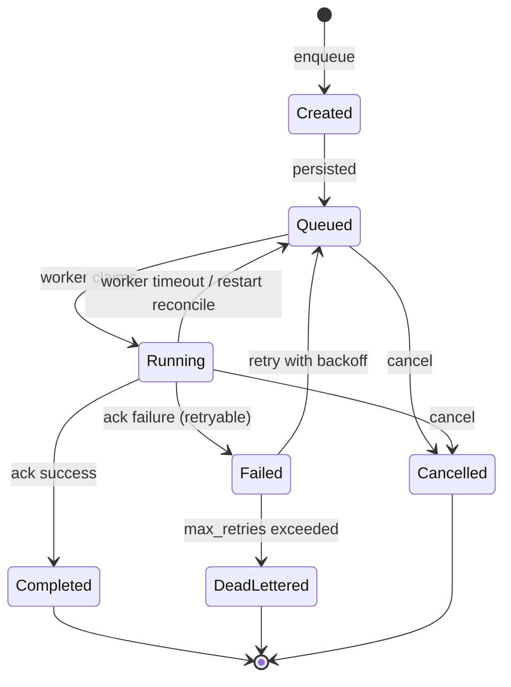

<p align="center">
  
</p>

<h1 align="center">ChopFlow</h1>

<p align="center">
  <strong>A durable distributed task queue built in Rust.</strong><br>
  Run background jobs across a fleet of workers with retries, resource-aware
  scheduling, task lifecycle tracking — and no heavyweight workflow engine.
</p>

<p align="center">
  <em>Celery-like task execution. Rust-native infrastructure. Built for distributed workloads.</em>
</p>

<p align="center">
  <a href="https://github.com/ricardoleal20/ChopFlow/actions"></a>
  <a href="https://github.com/ricardoleal20/ChopFlow"></a>
  <a href="LICENSE"></a>
  
  
</p>

<p align="center">
  🌐 <a href="https://chopflow.ricardoleal20.dev">Landing page</a> ·
  📦 <a href="https://github.com/ricardoleal20/ChopFlow">Source</a> ·
  📒 <a href="CHANGELOG.md">Changelog</a> ·
  🤝 <a href="CONTRIBUTING.md">Contributing</a>
</p>

---

> **Status: experimental.** APIs may change between minor versions. Not
> production-hardened yet — see the [roadmap](#roadmap) for what exists and
> what's planned.

## The 20-second demo

Three terminals, one queue — broker, worker, submit:

```text
┌─ Terminal 1 ─ broker ──────────────────────────────────────────┐
│ $ chopflow broker start --port 7331 --storage memory           │
│ ChopFlow gRPC  on 127.0.0.1:7331                               │
│ ChopFlow HTTP/ on 127.0.0.1:8080  (dashboard)                  │
│ ✓ storage initialized (memory)                                 │
│ ✓ reconciled in-flight tasks: 0 reset                          │
└────────────────────────────────────────────────────────────────┘
┌─ Terminal 2 ─ worker ──────────────────────────────────────────┐
│ $ chopflow worker --broker http://localhost:7331 \             │
│     --tags gpu,ml --resources cpu:8,gpu:1                      │
│ Worker registered with ID: a7cd3a11-…d1459a81d                 │
│ worker-01 connected · resources: cpu=8 gpu=1                   │
└────────────────────────────────────────────────────────────────┘
┌─ Terminal 3 ─ submit ──────────────────────────────────────────┐
│ $ chopflow submit train-model.json --tags gpu,ml               │
│ task 7f821a… queued                                            │
│ task 7f821a… → running on worker-01                            │
│ task 7f821a… → completed (1.42s)                               │
└────────────────────────────────────────────────────────────────┘
```

Reproduce it for real with `bash demos/run.sh` (builds the workspace, starts an
in-memory broker with `--open`, a demo worker, and seeds live tasks).

## Why ChopFlow?

Celery, BullMQ, Sidekiq, Ray and Apalis all exist. Why another queue?

ChopFlow targets a specific gap: **durable distributed execution for
heterogeneous workers**, without becoming a workflow engine. Workers declare
real resources (CPU, GPU, memory) and pull work they can actually run; the
broker persists every task and reconciles in-flight work on restart so nothing
is silently dropped. The whole system — gRPC broker, HTTP/JSON API, and a live
operations dashboard — ships from **one binary**.

|                                   | ChopFlow | Celery  | BullMQ  | Ray     |
| --------------------------------- | -------- | ------- | ------- | ------- |
| Rust-native core                  | ✅        | ❌       | partial¹| ❌       |
| Dedicated task broker (1 binary)  | ✅        | ✅       | ✅       | —       |
| Pull-based workers                | ✅        | ❌       | ✅       | partial |
| Resource-aware dispatch (CPU/GPU) | ✅        | limited | limited | ✅       |
| Worker tags / routing             | ✅        | ✅       | ✅       | limited |
| Explicit task lifecycle           | ✅        | ✅       | ✅       | ✅       |
| Retries + dead-letter             | ✅        | ✅       | ✅       | limited |
| Cron + one-shot scheduling        | ✅        | ✅       | —       | ❌       |
| Embedded ops dashboard            | ✅        | ❌       | partial | partial |
| Workflow engine / DAGs            | ❌        | ❌       | ❌       | partial |

> ¹ BullMQ added an official Rust client recently; its core remains Node/Redis.
>
> Only features ChopFlow has **today** are marked ✅. If something is missing,
> it's not on this table — see the [roadmap](#roadmap).

If you need DAG orchestration, Temporal-class workflows, or a battle-tested
fleet running millions of jobs/day in production, ChopFlow isn't there yet.
If you want a small, inspectable distributed queue you can actually read
end-to-end and extend — read on.

## How it works



ChopFlow takes units of background work — training jobs, reports, pipeline
stages, image processing — and moves them through an explicit, observable
lifecycle from submission to a terminal state, across a fleet of workers.

- **You enqueue a task** (from the CLI or HTTP API) with a payload, tags, an
  optional ETA, resource requirements, and a retry policy.
- **The broker persists it** (SQLite by default, in-memory for tests) and
  reconciles in-flight work on restart — no silently dropped tasks.
- **Workers pull matching work** by tag and available resources (CPU, GPU,
  memory). Dispatch is pull-based, so backpressure is implicit.
- **Workers acknowledge** each task with a success or structured failure;
  failures retry with exponential backoff, then dead-letter.
- **You watch it live** in the embedded dashboard — queue depth, worker
  capacity, task attempts, timing, and terminal failures — served from the
  same binary, no separate frontend deploy.

Optionally, schedule recurring or one-shot work with cron and overlap
policies, and run the whole dashboard as a native macOS app via Tauri.

## Quick start

### Prerequisites

- Rust (2021 edition) and Cargo
- (optional) `pnpm` for dashboard dev, Docker for the container path

### Install

The `chopflow` umbrella crate gives you the broker, CLI, and MCP server in one
install — three binaries: `chopflow-broker`, `chopflow-cli`, `chopflow-mcp`.

```bash
cargo install chopflow
```

Or with Homebrew:

```bash
brew tap ricardoleal20/chopflow
brew install chopflow
```

Workers ship separately (they run your handler code):

```bash
cargo install chopflow_worker
```

Python client / worker SDK:

```bash
pip install chopflow
```

### From source

```bash
git clone https://github.com/ricardoleal20/ChopFlow.git
cd ChopFlow
cargo build --release
```

Start the broker (gRPC on `:8000`, dashboard + HTTP API on `:8080`):

```bash
./target/release/chopflow_broker start --port 8000 --http-port 8080 --open
```

In a second terminal, start a worker:

```bash
./target/release/chopflow_worker start \
    --broker http://localhost:8000 --tags gpu,ml --resources cpu:8,gpu:1
```

In a third, enqueue a task:

```bash
echo '{"message":"hello"}' > /tmp/task.json
./target/release/chopflow_cli --broker http://localhost:8000 \
    enqueue --task /tmp/task.json --name echo --tags gpu,ml
```

Open <http://localhost:8080> to watch it flow through the dashboard.

### With Docker

```bash
docker compose up --build      # broker + one worker, dashboard on :8080
```

### One-command demo

```bash
bash demos/run.sh
```

This builds the workspace, starts an in-memory broker with `--open`, starts a
demo worker wired to four showcase handlers, and seeds one task of each type
plus a cron and a one-shot schedule. See [Demo handlers](#demo-handlers).

## Features

- **Task Queue Management**: enqueue and dequeue tasks with metadata (tags, ETA)
- **Worker Dispatch**: pull-based assignment by tag and resource availability
- **Acknowledgments & Retries**: workers ack success or failure; failures retry
  with exponential backoff, then dead-letter
- **Resource Tracking**: CPU, GPU, and memory allocation and live utilization
  per worker; a worker only claims a task whose requirements it can satisfy
- **Scheduling**: cron (5-field) and one-shot schedules with overlap policies
  (`skip` / `coalesce` / `allow`)
- **Durability & Reconciliation**: SQLite persistence; on broker restart,
  in-flight `Running` tasks reset to `Queued` and schedule fires recompute —
  no silently dropped tasks
- **Metrics**: queue length, latency, throughput, and resource utilization
- **Operations Dashboard**: embedded React UI served from the broker binary,
  also available as a native macOS app via Tauri
- **Research Focus**: designed for reproducible experiments and performance
  comparison (see [BENCHMARKS.md](BENCHMARKS.md))

## Components

- **Core** (`core`): Rust library — `Task`, `Queue`, `Dispatcher`,
  `RetryPolicy`, `Schedule`, `Storage`, resources
- **Broker** (`broker`): gRPC + HTTP/JSON server, embeds the dashboard UI,
  owns shared `BrokerState`, runs the schedule ticker and timeout monitor
- **Worker** (`worker`): pulls work from the broker by tag + resource match,
  acks results, sends heartbeats
- **CLI** (`cli`): `chopflow_cli` — enqueue, status, schedule management
- **Demos** (`demos`): example handlers, seed tooling, one-command demo run
- **MCP server** (`mcp`): optional Model Context Protocol server (stdio) that
  exposes the broker through all three MCP primitives — tools (actions),
  resources (live cluster state), and prompts (ready-made agent workflows) — so
  an assistant like Claude Desktop or Cursor can enqueue tasks, run LLM jobs,
  and manage schedules with no glue code. Adds no new broker surface. See
  [`mcp/README.md`](mcp/README.md) and the
  [MCP docs page](https://chopflow.ricardoleal20.dev/docs.html#mcp).
- **LLM worker** (`llm-worker`): a ChopFlow worker whose handlers call an
  OpenAI-compatible LLM (`llm.complete` / `llm.chat`). This is MCP Phase 2:
  ChopFlow driving an LLM. An agent enqueues an LLM task via the MCP server's
  `run_llm_task` tool; this worker executes it and acks the result. See
  [`llm-worker/README.md`](llm-worker/README.md).
- **Client libraries**: Python and Java clients speak gRPC to the broker — see
  [`clients/python`](clients/python) and [`clients/java`](clients/java). The
  proto contract is in `proto/proto/chopflow.proto`

## Architecture

### Task lifecycle



A task moves through `Created → Queued → Running` and terminates at
`Completed`, `DeadLettered`, or `Cancelled`. Failures retry with exponential
backoff up to `max_retries`. If a worker dies or a task times out, the broker's
reconciliation resets it to `Queued` so another worker can pick it up —
at-least-once execution.

### Storage backends

| Backend   | Use case                          | Durable? |
| --------- | --------------------------------- | -------- |
| `sqlite`  | Default; production-ish single node | ✅        |
| `memory`  | Tests, demos, ephemeral runs      | ❌        |

## Operations Dashboard UI

The broker ships with an embedded web dashboard — no separate frontend deploy
needed. It serves HTTP/JSON (for the UI and any external tooling) alongside
gRPC, both reading the same live broker state. The same dashboard is also
available as a native **macOS app** via Tauri.

```bash
# gRPC on :8000 (workers/CLI), dashboard + HTTP API on :8080
./target/release/chopflow_broker start --host 127.0.0.1 --port 8000 --http-port 8080
```

Open `http://localhost:8080` in a browser to:

- Watch live cluster stats (queue length, processing, completed, failed, workers)
- Browse and filter the task ledger, with status badges and result previews
- See connected workers with live resource meters
- Enqueue tasks and cancel queued/running ones from the UI

The HTTP API is also available directly:

| Method | Endpoint                  | Purpose                  |
|--------|---------------------------|--------------------------|
| GET    | `/api/stats`              | Cluster counts           |
| GET    | `/api/tasks?status=`      | List/filter tasks        |
| GET    | `/api/tasks/:id`          | Single task              |
| POST   | `/api/tasks`              | Enqueue a task           |
| POST   | `/api/tasks/:id/cancel`   | Cancel a non-terminal task |
| GET    | `/api/workers`            | Registered workers       |

**The UI stack:** the dashboard is a React + Vite + Tailwind app in
`broker/ui/` (TypeScript, TanStack Query, framer-motion), built to the visual
contract in `docs/design/DESIGN.md`. It polls the HTTP API above every 2s and
renders live stats, the task ledger, workers, a task detail drawer, and an
enqueue dialog. The built bundle in `broker/ui/dist/` is what the broker
embeds (via `rust-embed`).

**Iterative web dev** against a live broker (the Vite dev server proxies
`/api` to `http://localhost:8080`):

```bash
pnpm --dir broker/ui install     # first time only
pnpm --dir broker/ui dev         # http://localhost:5173, hot reload
```

**Rebuild the embedded web bundle** (committed so the broker compiles from a
fresh clone without a Node toolchain):

```bash
pnpm --dir broker/ui build
touch broker/src/http.rs         # force rust-embed to re-read ui/dist
cargo build
```

Or run the broker with `--open` to launch the embedded dashboard in a browser.

**Native macOS app (Tauri):** the same React frontend is wrapped as a desktop
app via Tauri 2, living in `app/src-tauri/`. It points at the broker's HTTP
API at `http://127.0.0.1:8080` (set via `VITE_API_BASE` in
`broker/ui/.env.tauri`), so it is a first-class client of the same broker a
browser would use — nothing is forked or re-implemented.

```bash
pnpm --dir broker/ui install          # first time only
# Start the broker first (gRPC :8000, HTTP :8080):
./target/release/chopflow_broker start --port 8000 --http-port 8080

cd app && ../broker/ui/node_modules/.bin/tauri dev    # launch the desktop app
# or build a signed .app bundle:
cd app && ../broker/ui/node_modules/.bin/tauri build
```

## Scheduled tasks

ChopFlow ships a first-class `Schedule` entity that the broker materializes into
`Task`s on a background ticker (one tick per second). A schedule is either:

- **Cron** — a standard 5-field cron expression (e.g. `*/2 * * * *`, `0 9 * * *`).
  The broker normalizes it to the 6-field form the `cron` crate expects. The
  server evaluates cron and ETAs in **UTC**; the dashboard converts from the
  local picker before sending.
- **One-shot** — fires once at an RFC3339 ETA, then self-disables.

Each schedule carries an **overlap policy** that governs what happens when a
fire is due but a previous run for the same schedule is still in flight
(Queued or Running):

| Policy    | Behavior                                                          |
|-----------|-------------------------------------------------------------------|
| `skip`    | Skip this fire and advance `next_fire` (cron). Default.           |
| `coalesce`| Skip this fire (treated like `skip` for now; reserved for merging).|
| `allow`   | Materialize the task anyway — concurrent runs permitted.          |

Missed cron runs are **not** backfilled: on broker startup, enabled cron
schedules have their `next_fire` recomputed from `now`, so the ticker only
fires future matches. A disabled one-shot with a past ETA stays disabled until
re-enabled.

### Managing schedules

**CLI** (`schedule` subcommand):

```bash
# A recurring cron schedule
./target/release/chopflow_cli schedule create \
    --name nightly-build --task build --cron "0 9 * * *" \
    --tags ci --resources cpu:4 --overlap skip

# A one-shot 5 minutes out
./target/release/chopflow_cli schedule create \
    --name one-off-report --task report --eta 2026-09-03T14:30:00Z --overlap allow

./target/release/chopflow_cli schedule list
./target/release/chopflow_cli schedule delete <schedule-id>
```

**HTTP API**:

| Method | Endpoint                  | Purpose                                  |
|--------|---------------------------|------------------------------------------|
| GET    | `/api/schedules`          | List all schedules                       |
| POST   | `/api/schedules`          | Create a schedule (cron or oneshot)      |
| GET    | `/api/schedules/:id`      | Get a single schedule                    |
| PATCH  | `/api/schedules/:id`      | Toggle `enabled`, change overlap or cron |
| DELETE | `/api/schedules/:id`      | Delete a schedule                        |

`GET /api/stats` also reports `schedules` (count of enabled schedules). The
dashboard's Schedules view lists every schedule, lets you enable/disable, run
now (which enqueues a one-off task from the template without disturbing the
schedule's overlap accounting), and delete.

## Demo handlers

The `demos` workspace crate ships a drop-in demo worker plus a seeding tool so
`cargo run` produces a live dashboard end-to-end. The demo worker registers
four showcase handlers (plus `echo` and a `default` fallback):

| Handler            | What it does                                                        |
|--------------------|---------------------------------------------------------------------|
| `resize_image`     | Generates a synthetic gradient PNG and resizes it (image-rs).        |
| `batch_compute`    | CPU-bound `n x n` f64 matrix multiply (nalgebra), reports timings.  |
| `simulate_pipeline`| Multi-stage pipeline (download/process/upload) with staged sleeps. |
| `flaky_handler`    | Fails ~30% of the time (seeded) to exercise the retry policy.        |

### One-command demo run

```bash
bash demos/run.sh
```

This builds the workspace, starts an in-memory broker with `--open` (launches
the dashboard at `http://localhost:8080`), starts a demo worker wired to the
four handlers above (`--tags demo,ml --resources cpu:4`), then seeds:

- One task of each handler type (the `flaky_handler` one with `max_retries: 5`
  so you can watch it retry).
- A `*/2 * * * *` cron schedule running `batch_compute` with overlap `skip`.
- A one-shot `simulate_pipeline` schedule 5 minutes out with overlap `allow`.

You'll see four tasks flow through distinct lifecycles in the dashboard, the
`flaky_handler` visibly retrying, and two schedules ticking in the Schedules
view. Ctrl+C stops the broker and worker.

You can also seed a running broker manually:

```bash
cargo run -p chopflow_demos --bin chopflow_demo_seed -- [broker_base_url]
# broker_base_url defaults to http://localhost:8080
```

### More demos

A few focused scripts live in `demos/` to exercise specific behaviors — see
[`demos/README.md`](demos/README.md):

- **Multi-worker dispatch** — two workers with different tags/resources share the queue.
- **Worker failure & retry** — kill a worker mid-task and watch the broker
  requeue and re-dispatch the work.

## Benchmarks

End-to-end through the broker's HTTP API + one worker (`cpu:4`), Apple M3 Pro
(11 cores), in-memory storage, `echo` no-op workload. Real numbers, measured on
one machine — never extrapolated. Full methodology, charts, and a live
benchmarks page: [`BENCHMARKS.md`](BENCHMARKS.md) and
[`docs/design/chopflow-benchmarks.html`](docs/design/chopflow-benchmarks.html).

**Peak drain throughput: 15,153 tasks/s** (100k tasks) — sustained 14,813 tasks/s
at 1M tasks, with **0 failures across 1.21M tasks**.

### ChopFlow scaling

| Tasks      | Throughput (drain) | p50 latency | p95 latency | p99 latency |
|------------|--------------------|-------------|-------------|-------------|
| 1,000      | 4,573 tasks/s      | 561 ms      | 585 ms      | 587 ms      |
| 10,000     | 12,811 tasks/s     | 507 ms      | 1,015 ms    | 1,016 ms    |
| 100,000    | 15,153 tasks/s     | 3,408 ms    | 5,736 ms    | 6,217 ms    |
| 1,000,000  | 14,813 tasks/s     | 30,396 ms   | 55,118 ms   | 57,263 ms   |

### Head-to-head — drain throughput (tasks/s)

Same machine, same `echo` workload, same 4-slot worker shape, sweep 1K→1M.
`DNF` = did not finish within the time budget (reported honestly, not omitted).

| System   | 1K    | 10K   | 100K   | 1M      |
|----------|-------|-------|--------|---------|
| **ChopFlow** | 4,573 | 12,811 | 15,153 | 14,813  |
| BullMQ   | 7,407 | 9,191 | 10,140 | 10,262  |
| Ray      | 3,307 | 6,863 | 8,239  | DNF     |
| Celery   | 1,166 | 1,644 | 1,749  | DNF     |
| Temporal | 42    | 43    | DNF    | DNF     |

ChopFlow wins at 100K and 1M — **44% faster than BullMQ at 1M** (14,813 vs
10,262 tasks/s). BullMQ leads the 1K/10K echo race (lower per-task dispatch
overhead via Redis Streams); ChopFlow pulls ahead as scale rises and its
in-memory broker avoids per-task Redis round-trips.

> **Category caveats (honest, not a flaw in either system):** Temporal is a
> durable workflow engine that persists every step — a heavier category by
> design, included for context. Ray is a distributed-compute framework
> (Dask/Spark-like); its throughput includes object-store + cross-actor
> scheduler cost — apples-to-pears. Celery 1M and Ray 1M did not complete
> within the time budget.

Reproduce with:

```bash
bash bench/run.sh                          # ChopFlow 1K/10K/100K sweep
TASKS="1000 10000 100000 1000000" bash bench/run.sh   # add the 1M run
bash bench/compare/run_compare.sh          # Celery + Temporal + BullMQ + Ray
```

## Roadmap

Only real, implemented work is marked ✅. Everything else is planned, not
promised.

### v0.1 — initial public preview
- ✅ Durable task storage (SQLite + in-memory)
- ✅ Worker registration with tags + resources
- ✅ Pull-based dispatch
- ✅ Retries with exponential backoff + dead-letter
- ✅ Resource-aware scheduling (CPU / GPU / memory)
- ✅ Priority queues (priority-ordered claim)
- ✅ Bounded worker concurrency (resource-sized pool + backpressure)
- ✅ Cron + one-shot schedules with overlap policies
- ✅ Broker reconciliation on restart
- ✅ CLI (enqueue, status, schedules)
- ✅ Embedded operations dashboard
- ✅ Native macOS app (Tauri)
- ✅ MCP server (agent-native control + LLM tasks)
- ✅ Python client library
- ✅ Java client library

### v0.2 — next
- ⬜ Improved observability (metrics export, OpenTelemetry traces)
- ⬜ Docker images published to a registry
- ⬜ Result store / `AsyncResult` handle

### v0.3 — later
- ⬜ Worker autoscaling hooks
- ⬜ Distributed / multi-broker benchmarks
- ⬜ At-most-once delivery option (idempotency keys)
- ⬜ Pluggable storage backends (Postgres)

Have an opinion on what should be here? Open an issue — the roadmap is shaped
by the people who'd use it.

## Client libraries (Python / Java)

The client ergonomics — a Celery-like `@task` decorator and an
`AsyncResult` handle, speaking gRPC to the broker:

```python
from chopflow import task, Client

@task(tags=["ml"], resources={"gpu": 1})
def train_model(dataset, hyperparams):
    # Your training code here
    return {"accuracy": 0.95}

# Enqueue for asynchronous execution
result = train_model.delay("imagenet", {"lr": 0.001})

# Get result when ready
output = result.get(timeout=3600)
```

These client libraries have landed in [`clients/python`](clients/python) and
[`clients/java`](clients/java); the gRPC contract they speak is defined in
`proto/proto/chopflow.proto`. Both are ready to use — see each client's README
for installation and examples.

## Documentation

- **Landing page:** <https://chopflow.ricardoleal20.dev>
- **Design system (canonical):** [`docs/design/DESIGN.md`](docs/design/DESIGN.md)
- **Docs site (in progress):** `docs/design/chopflow-docs.html`

## License

This project is licensed under the Apache-2.0 License — see the
[LICENSE](LICENSE) file for details.

## How to participate?

Contributions are welcome. A quick guide:

1. **Read the working agreement** — [`CONTRIBUTING.md`](CONTRIBUTING.md)
   covers dev setup, branch naming, the gitmoji + Action commit format, PR
   rules, the design system, and how to add a new client library.
2. **Pick something to work on** — browse
   [open issues](https://github.com/ricardoleal20/ChopFlow/issues), especially
   [`good first issue`](https://github.com/ricardoleal20/ChopFlow/labels/good%20first%20issue).
   For non-trivial work, open an issue first so we can align on scope before
   you code.
3. **Branch from `main`** using `ricardo/{topic}-{what-it-solves}`.
4. **Keep the tree clean** — `cargo fmt`, `cargo clippy -- -D warnings`,
   `cargo test` should all pass.
5. **Open a PR** with the four-section description (`Summary`, `Changes`,
   `Test plan`, `Refs`) and assign yourself. All changes require review from
   the codeowner (see [`.github/CODEOWNERS`](.github/CODEOWNERS)).

Good first contributions: landing-page / docs polish, additional demo
handlers, a new client library (Python or Java over the existing gRPC proto),
and expanding the docs site.

## Acknowledgments

- Inspired by systems like Celery, Ray, and Dask.
